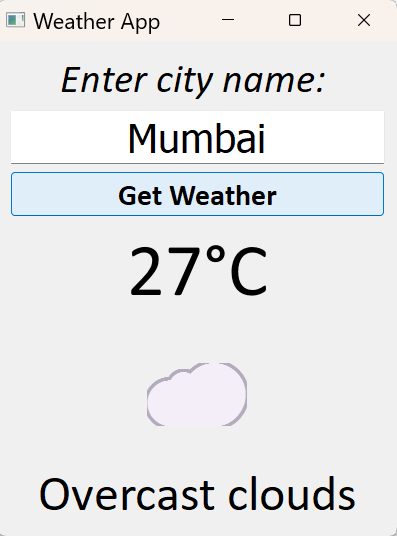

# 🌦️ Weather App

A simple desktop weather application built with **Python (PyQt5)** and the **OpenWeather API**.  
It shows live weather details like temperature, condition, and uses emojis for easy visualization.  

---

## ✨ Features
- Enter any city name to get **real-time weather**  
- Displays **temperature in Celsius**  
- Weather condition with **emoji icons** (☀️, 🌧️, ❄️ etc.)  
- Error handling for invalid city names or no internet connection  

---

## 🖼️ Preview
Here’s a screenshot of the app in action:  



---

## 🛠️ Built With
- Python  
- PyQt5 (for GUI)  
- Requests (for API calls)  
- OpenWeather API  
- JSON (for data parsing)  

---

## 🚀 Getting Started

### 1️⃣ Clone the repo
```bash
git clone https://github.com/zaidbagwan786123-ux/Weather-Api.git

2️⃣ Install dependencies
bash
Copy code
pip install PyQt5 requests

3️⃣ Add your API key
Get a free API key from OpenWeather

Open weather_app.py and replace api_key with your own key

4️⃣ Run the app
bash
Copy code
python weather_app.py
📜 License
This project is open-source and free to use.

